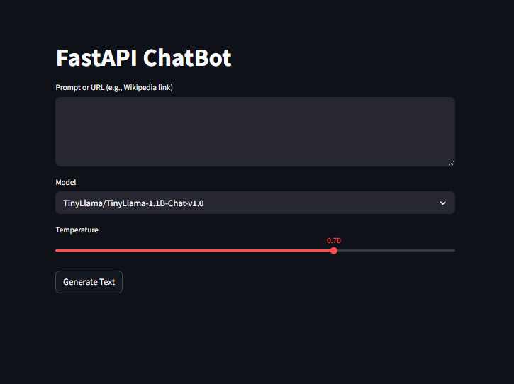
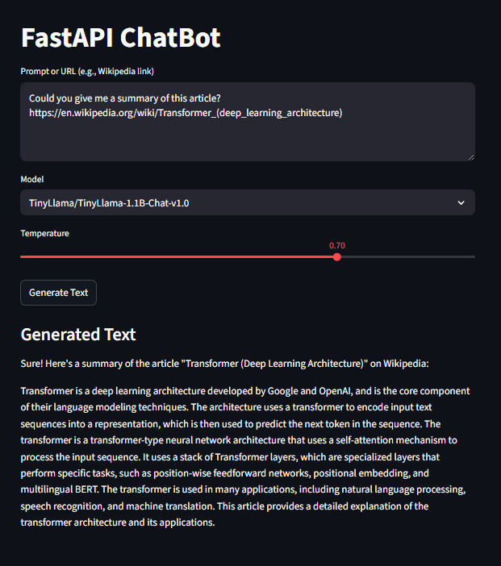

# LLM web scrapper

Project aimed to extract information from Wikipedia and provide it as context for an LLM application using **Streamlit**, **FastAPI** and **TinyLlama-1.1B-Chat-v1.0** chat model using **Transformers** library from HuggingFace.


This application is composed of two main parts:

FastAPI Backend : A robust API that receives a prompt, uses aiohttp and BeautifulSoup4 to scrape content from URLs found in the prompt, and then feeds this context to an LLM called TinyLlama to generate a response.


1. Create and activate a virtual environment:
````bash
python -m venv .env

source .env/Scripts/activate
````

2. Install the required dependencies.
````bash
pip install -r requirements.txt
````

3. To run FastAPI, simply run:
 ````bash
python -m uvicorn src.main:app --reload
````

4. For the client run the following command:
````bash
streamlit run ./src/client.py
````

This will automatically open a new tab in your default web browser, displaying the following interface::



5. Let's try this prompt:
````
Could you give me a summary of this article? https://en.wikipedia.org/wiki/Transformer_(deep_learning_architecture)
````

6. You should obtain a similar response, noting that results may vary slightly due to the non-deterministic nature of generative AI: 

